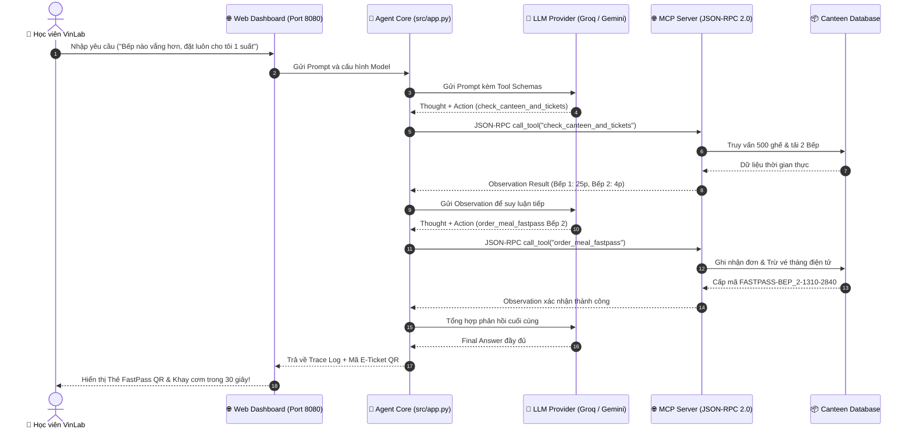

# 🎤 TÀI LIỆU THUYẾT TRÌNH & BẢO VỆ BÀI LAB 3 (CHUẨN 5 TIÊU CHÍ)

> **Học viên:** Trần Tuấn Tú  
> **MSSV:** 2A202602840 — Lớp: K4B  
> **Đề tài:** Trợ lý Điều Phối Suất Ăn & Phân Luồng FastPass Nhà Ăn VinLab (*VinLab Canteen Dispatcher ReAct Agent*)  
> **Giao diện Trực quan:** Web Dashboard chạy tại `http://localhost:8080`  

---

## 1. CHỌN ĐỀ TÀI GÌ? TẠI SAO CHỌN ĐỀ TÀI ĐÓ?

### 📌 Tên đề tài:
**Trợ lý Điều Phối Suất Ăn & Phân Luồng FastPass Nhà Ăn VinLab** (*VinLab Smart Canteen & FastPass Agent*)

### 🎯 4 Pain Points thực tế hàng ngày của học viên:
1. **Khủng hoảng 1000 người vs 500 ghế:** Khóa học có 1000 học viên cùng tan học ca sáng lúc 13h00, nhưng nhà ăn chỉ có **500 ghế ngồi** (quá tải 200%). Nếu không có giải pháp mang về phòng học (Takeaway), một nửa số học viên sẽ không có chỗ ăn.
2. **Khung giờ nghỉ eo hẹp:** Lịch học từ 9h00 đến 18h00 rất căng thẳng, nghỉ trưa chỉ có đúng **60 phút (13h00 – 14h00)** để ăn uống và nạp lại năng lượng.
3. **Hai bếp độc lập cạnh tranh nhau:**
   - **Bếp 1 (Nhà thầu A - Cơm phần truyền thống):** Thường xuyên quá tải (hàng đợi 88 người, thời gian chờ ~25 phút).
   - **Bếp 2 (Nhà thầu B - Bún mì & Eat Clean Healthy):** Thông thoáng (chỉ chờ ~4 phút). Thiếu hệ thống điều phối khiến học viên dồn hết vào Bếp 1.
4. **Nút thắt thủ công ở khâu thanh toán & soát vé:**
   - *Học viên vé tháng:* Chủ quán phải cầm kìm bấm từng lỗ thủ công trên thẻ giấy $\rightarrow$ cực kỳ chậm.
   - *Học viên vé ngày:* Phải đứng mở app ngân hàng quét QR chuyển khoản rồi chờ chủ đối chiếu màn hình điện thoại.
   - **Hậu quả:** Học viên mất **30–40 phút chỉ để xếp hàng lấy cơm**, mất sạch thời gian nghỉ trưa.

---

## 2. TẠI SAO REACT AGENT PATTERN LẠI PHÙ HỢP?

### ❌ Vì sao Chatbot truyền thống (Cấp 2) thất bại?
Chatbot thông thường chỉ trả lời văn bản tĩnh dựa trên prompt, không kết nối dữ liệu thời gian thực, không biết Bếp 1 đang nghẽn hay còn bao nhiêu ghế trống, và dễ bị **ảo giác (Hallucination)** khi học viên hỏi về tình trạng thẻ vé hay đặt suất ăn.

### ✅ ReAct Agent (Cấp 3) giải quyết như thế nào?
Vòng lặp ReAct (**Thought $\rightarrow$ Action $\rightarrow$ Observation**) cho phép Agent suy nghĩ logic từng bước, chủ động gọi công cụ qua giao thức MCP để kiểm tra tình trạng thực tế và tự động ra quyết định điều phối.

### 📊 Bảng Chấm Điểm 4 Tiêu Chí Agentic Fit (19 / 20 Điểm):

| Tiêu chí | Điểm | Giải trình sắc bén |
| :--- | :---: | :--- |
| **1. Multi-step Reasoning** | **5 / 5** | Phải suy luận liên hoàn: Tra cứu ghế & vé $\rightarrow$ So sánh độ tải 2 bếp $\rightarrow$ Nếu ghế < 50, chủ động tư vấn Takeaway $\rightarrow$ Đặt suất ăn và cấp FastPass. |
| **2. Tool Interaction** | **5 / 5** | Kết nối trực tiếp với MCP Server (JSON-RPC 2.0) để lấy dữ liệu thời gian thực của 2 bếp và thực thi ghi nhận đặt chỗ. |
| **3. Dynamic Decision** | **5 / 5** | Quyết định bước sau hoàn toàn dựa trên Observation bước trước: Bếp 1 nghẽn $\rightarrow$ lái sang Bếp 2; Nhà ăn đầy $\rightarrow$ chuyển sang Takeaway; Vé ngày $\rightarrow$ tự tạo VietQR tự xác thực. |
| **4. Long Horizon Goal** | **4 / 5** | Giữ mục tiêu tối thượng: Giúp học viên có khay cơm trước 13h10 và quay lại lớp nghỉ ngơi trước 14h00. |

---

## 3. KIẾN TRÚC AGENT ĐÃ XÂY DỰNG

Hệ thống được thiết kế theo chuẩn **Model Context Protocol (MCP)**:

---

## 4. CÁC CÔNG CỤ (TOOLS) ĐÃ XÂY DỰNG & TÁC DỤNG

| Tên Tool | Loại | Tham số chính | Tác dụng cốt lõi |
| :--- | :---: | :--- | :--- |
| **`check_canteen_and_tickets`** | *Query* | `student_id`, `preferred_kitchen` | Tra cứu số ghế trống (500 ghế), thời gian chờ & hàng đợi 2 Bếp, thực đơn hôm nay, và số lượt vé tháng còn lại của học viên. |
| **`order_meal_fastpass`** | *Action* | `student_id`, `kitchen_id`, `pickup_time`, `dining_option`, `meal_item` | Đặt trước suất ăn, trừ vé tháng điện tử (xóa bỏ bấm lỗ kìm) hoặc sinh VietQR 35k tự xác thực, cấp mã **FastPass** nhận khay cơm trong 30 giây tại làn ưu tiên. |

---

## 5. KỊCH BẢN DEMO TRỰC TIẾP (2 PHÚT ĂN ĐIỂM)

Mở Web Dashboard tại `http://localhost:8080` (hoặc chạy CLI `python src/app.py --interactive`):

### 🎬 Câu Demo 1: Tra cứu thông minh & Tự động cảnh báo
> **Prompt:** *"Hãy kiểm tra tình trạng số ghế trống của nhà ăn và thông tin thẻ vé tháng của học viên Trần Tuấn Tú mã số 2A202602840."*

* **Hiển thị trên màn hình:**
  - Agent gọi tool `check_canteen_and_tickets`.
  - Phân tích số ghế: Đã ngồi 465/500, chỉ còn 35 ghế trống (cảnh báo nguy cơ hết chỗ).
  - So sánh 2 bếp: Bếp 1 chờ 25 phút vs Bếp 2 chờ 4 phút.
  - Thẻ vé của Tú: Vé tháng còn 18/30 lỗ bấm.
  - Khuyên học viên chọn Takeaway mang về phòng tự học.

---

### 🎬 Câu Demo 2: Chuỗi ReAct đa bước (Tự phân luồng & Xuất vé FastPass)
> **Prompt:** *"Tôi là học viên 2A202602840, hãy kiểm tra xem bếp nào vắng hơn và đặt luôn cho tôi 1 suất ở bếp đó lúc 13:10 mang về phòng học để kịp nghỉ trưa nhé."*

* **Hiển thị trên màn hình:**
  - **Vòng lặp ReAct đa bước tự động:**
    - Bước 1: Gọi `check_canteen_and_tickets` $\rightarrow$ Thấy Bếp 2 tối ưu vượt trội.
    - Bước 2: Tự động gọi `order_meal_fastpass` $\rightarrow$ Đặt Bếp 2, Takeaway, giờ nhận 13:10.
  - **Xuất hiện Thẻ E-Ticket phát sáng:**
    - Mã FastPass: `FASTPASS-BEP_2-1310-2840` kèm **Mã QR thực tế** trên màn hình.
    - Tự động trừ 1 lượt vé tháng (còn 17/30 lượt).
    - Hướng dẫn nhận đồ: Đến làn Fast-Track quét mã lấy khay cơm trong 30 giây.
