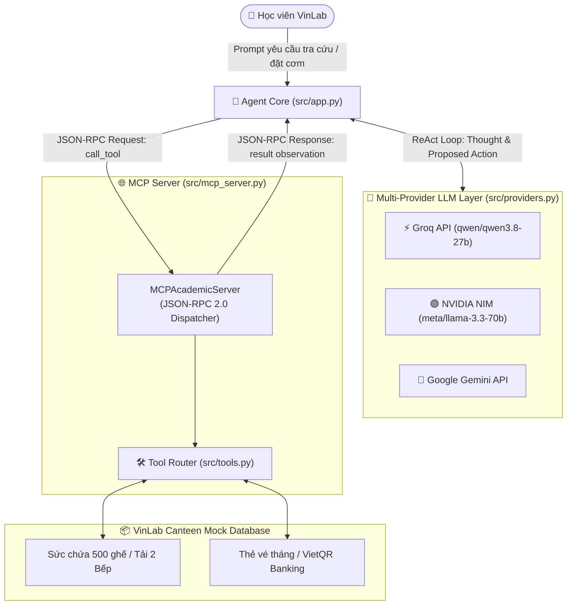

# 📊 BÁO CÁO THU HOẠCH NGHIỆM THU BÀI LAB 3 (BƯỚC 3 — SUBMISSION ARTIFACT)

> **Họ và Tên Học viên:** Trần Tuấn Tú  
> **Mã Sinh Viên / Mã Học viên:** 2A202602840  
> **Lớp:** K4B (Lớp Chiều)  
> **Chủ đề Lựa chọn:** Trợ lý Điều Phối Suất Ăn & Phân Luồng FastPass Nhà Ăn VinLab (VinLab Smart Canteen & FastPass Dispatcher Agent)  

---

## 1. CHỌN ĐỀ TÀI GÌ? TẠI SAO CHỌN ĐỀ TÀI ĐÓ?

### 🍱 Tên đề tài:
**Trợ lý Điều Phối Suất Ăn & Phân Luồng FastPass Nhà Ăn VinLab** (*VinLab Canteen Dispatcher Agent*)

### 🎯 Lý do lựa chọn & Pain Points thực tế:
Bài toán xuất phát từ chính nỗi đau (**pain points**) thực tế hàng ngày của các học viên theo học tại VinLab:
1. **Lịch học dày đặc & Thời gian nghỉ eo hẹp:** Học viên học từ 9h00 đến 18h00, chỉ có đúng **60 phút nghỉ trưa (13h00 – 14h00)** để ăn uống, hồi phục thể lực và chuẩn bị cho ca học chiều.
2. **Khủng hoảng sức chứa (Capacity Crunch):** 1000 học viên cùng tan học ca sáng lúc 13h00, trong khi nhà ăn chỉ có **500 ghế ngồi** (quá tải 200%). Nếu 100% học viên cùng ăn tại chỗ (Dine-in), ít nhất 500 người sẽ không có chỗ ngồi.
3. **Hai bếp độc lập cạnh tranh nhau:** Bếp 1 (Nhà thầu A - Cơm phần truyền thống) và Bếp 2 (Nhà thầu B - Bún mì than hoa & Eat Clean Healthy). Thiếu sự điều phối khiến Bếp 1 thường xuyên tắc nghẽn (hàng đợi 80+ người, chờ ~25 phút), trong khi Bếp 2 chỉ chờ dưới 5 phút.
4. **Nút thắt thủ công ở khâu thanh toán và soát vé (Manual Bottleneck):**
   - *Học viên vé tháng:* Chủ quán phải cầm kìm bấm từng lỗ thủ công trên thẻ giấy $\rightarrow$ thao tác rất chậm.
   - *Học viên vé ngày:* Phải đứng mở app ngân hàng quét QR, chờ chủ quán ngó màn hình đối chiếu $\rightarrow$ ùn ứ kéo dài.
   - Hậu quả: Học viên mất **30–40 phút chỉ để chen chúc lấy khay cơm**, gần như không còn thời gian nghỉ trưa.

---

## 2. TẠI SAO REACT AGENT PATTERN LẠI PHÙ HỢP ĐỂ GIẢI QUYẾT VẤN ĐỀ NÀY?

Mô hình Chatbot thông thường (Cấp 2) chỉ trả lời văn bản tĩnh, không có khả năng truy xuất dữ liệu động hay tương tác với hệ thống đặt món. ReAct Agent (*Thought $\rightarrow$ Action $\rightarrow$ Observation*) là chìa khóa giải quyết bài toán nhờ năng lực suy luận linh hoạt kết hợp gọi công cụ qua giao thức MCP.

### 📊 Bảng Chấm Điểm 4 Tiêu Chí Agentic Fit (Thang điểm 5):

| Tiêu chí Đánh giá | Mức độ (1 - 5) | Giải trình chi tiết lý do chọn điểm |
| :--- | :---: | :--- |
| **1. Multi-step Reasoning** | **5 / 5** | Bài toán đòi hỏi chuỗi suy luận liên hoàn: (1) Tra cứu tình trạng ghế trống & thẻ vé học viên $\rightarrow$ (2) So sánh tải hàng đợi giữa Bếp 1 và Bếp 2 $\rightarrow$ (3) Nhận diện nhà ăn sắp hết ghế (<50 chỗ) để chủ động tư vấn đóng hộp mang về (Takeaway) $\rightarrow$ (4) Đặt suất ăn và cấp mã FastPass nhận đồ nhanh. |
| **2. Tool Interaction** | **5 / 5** | Hệ thống phải kết nối với MCP Server qua giao thức JSON-RPC 2.0 để tương tác với 2 công cụ cốt lõi: truy vấn cơ sở dữ liệu thời gian thực và thực thi đặt suất ăn/xử lý thanh toán. |
| **3. Dynamic Decision** | **5 / 5** | Quyết định của Agent thay đổi thích ứng theo ngữ cảnh quan sát (Observation): Nếu Bếp 1 nghẽn hàng thì gợi ý chuyển sang Bếp 2; nếu ghế ngồi đã chiếm >90% thì chuyển sang Takeaway; nếu là vé tháng thì trừ lượt điện tử, nếu là vé ngày thì tự sinh mã VietQR chuyển khoản nhanh. |
| **4. Long Horizon Goal** | **4 / 5** | Agent theo dõi và giải quyết triệt để mục tiêu xuyên suốt: giúp học viên lấy được bữa trưa trong vòng **30 giây tại quầy ưu tiên** để đảm bảo trọn vẹn 60 phút nghỉ ngơi trước giờ học ca chiều. |
| **TỔNG ĐIỂM AGENTIC FIT** | **19 / 20** | *Đạt 19/20 điểm: Bài toán vận hành thực tế cực kỳ phù hợp để triển khai ReAct Agent.* |

---

## 3. KIẾN TRÚC AGENT ĐÃ XÂY DỰNG

Hệ thống được thiết kế theo kiến trúc **Model Context Protocol (MCP)** phân tách rõ ràng giữa Agent Core (Client), LLM Provider và MCP Server:



---

## 4. CÁC CÔNG CỤ (TOOLS) ĐÃ XÂY DỰNG & TÁC DỤNG

Hệ thống triển khai 2 công cụ chính tuân thủ chuẩn **JSON Schema Specification**:

### 🛠️ Tool 1: `check_canteen_and_tickets` (Tra cứu thông tin)
- **Mục đích:** Tra cứu tình trạng nhà ăn và kiểm tra thẻ vé của học viên theo thời gian thực.
- **Tham số đầu vào:**
  - `student_id` (string, bắt buộc): Mã học viên (ví dụ: `2A202602840`).
  - `preferred_kitchen` (string, tùy chọn): `bep_1` (Cơm phần) hoặc `bep_2` (Bún mì & Eat Clean).
- **Tác dụng:** Cung cấp số ghế trống (sức chứa 500), thời gian chờ & độ đông của 2 Bếp, thực đơn hôm nay, và số lượt vé tháng còn lại của học viên.

### 🛠️ Tool 2: `order_meal_fastpass` (Hành động & Cấp vé Fast-track)
- **Mục đích:** Đặt trước suất ăn và cấp mã FastPass nhận khay đồ ăn trong 30 giây tại làn ưu tiên.
- **Tham số đầu vào:**
  - `student_id` (string, bắt buộc): Mã học viên.
  - `kitchen_id` (string, bắt buộc): `bep_1` hoặc `bep_2`.
  - `pickup_time` (string, bắt buộc): Giờ nhận đồ phân luồng 15 phút (`13:05`, `13:20`, `13:35`).
  - `dining_option` (string, bắt buộc): `dine_in` (ăn tại chỗ) hoặc `takeaway` (mang về phòng tự học).
  - `meal_item` (string, tùy chọn): Tên món ăn cụ thể.
- **Tác dụng:** Xuất mã `FASTPASS-xxxx`, tự động trừ lượt vé tháng trên hệ thống điện tử (không cần bấm lỗ) hoặc tự sinh mã VietQR thanh toán 35.000đ tự động xác thực (không cần đối chiếu điện thoại).

---

## 5. DEMO VỚI CÂU HỎI TRỰC TIẾP & TRÍCH XUẤT TRACE LOG TỪNG BƯỚC

Hệ thống đã chạy nghiệm thu toàn bộ 5 Test Cases trên **LLM API thật (Groq - Model: `qwen/qwen3.8-27b`)**, xuất ra 17 sự kiện Waterfall Trace tại [`docs/trace_waterfall.json`](trace_waterfall.json).

### 🎬 Demo 1: Đặt suất ăn FastPass cho học viên vé ngày (TC03)

**Câu hỏi Prompt:**  
> *"Tôi là học viên SV2026002 (chưa có vé tháng). Hãy đặt trước giúp tôi 1 suất Bún chả Hà Nội ở Bếp 2 vào lúc 13:05 và đóng hộp mang về phòng tự học (takeaway)."*

**Trace Log từng bước từ `docs/trace_waterfall.json`:**
```json
[
  {
    "step": 1,
    "action_type": "TOOL_EXECUTION",
    "tool_name": "order_meal_fastpass",
    "arguments": {
      "dining_option": "takeaway",
      "kitchen_id": "bep_2",
      "meal_item": "Bún chả Hà Nội",
      "pickup_time": "13:05",
      "student_id": "SV2026002"
    },
    "observation": {
      "status": "SUCCESS",
      "fastpass_code": "FASTPASS-BEP_2-1305-6002",
      "student_id": "SV2026002",
      "student_name": "Trần Thị Bình",
      "kitchen": "Bếp 2 - Nhà Thầu B (Bún Mì & Eat Clean Healthy)",
      "meal_item": "Bún chả Hà Nội",
      "pickup_time": "13:05",
      "dining_option": "Mang về phòng tự học (Takeaway box)",
      "ticket_processing": "Tự động sinh mã VietQR thanh toán 35.000đ tới chủ bếp: 'NAPAS247-VINLAB-MEAL'. Quét chuyển khoản xong là hệ thống tự xác thực, không cần đưa điện thoại cho chủ kiểm tra.",
      "payment_status": "VietQR 35.000đ (Nội dung: CK-FASTPASS-COMTRUA)",
      "pickup_instructions": "Đúng 13:05, hãy đến CỬA FAST-TRACK CỦA BẾP 2 - NHÀ THẦU B (BÚN MÌ & EAT CLEAN HEALTHY), xuất trình mã FASTPASS-BEP_2-1305-6002 để lấy đồ trong 30 giây không cần xếp hàng!"
    },
    "latency_ms": 1782.35
  },
  {
    "step": 2,
    "action_type": "FINAL_ANSWER",
    "thought": "Groq (qwen/qwen3.8-27b) tổng hợp kết quả từ Observation và đưa ra phản hồi đầy đủ, giải quyết triệt để pain point xếp hàng cho học viên.",
    "output": "Chào bạn Trần Thị Bình (SV2026002), đặt suất ăn thành công! 🎉\n- Mã FastPass: FASTPASS-BEP_2-1305-6002\n- Bếp phục vụ: Bếp 2 – Nhà thầu B (Bún Mì & Eat Clean Healthy)\n- Món: Bún chả Hà Nội than hoa (Đóng hộp mang về phòng tự học)\n- Khung giờ nhận: 13:05\n- Thanh toán: Quét VietQR 35.000đ với nội dung 'CK-FASTPASS-COMTRUA', hệ thống tự động xác thực mà không cần đưa điện thoại cho chủ bếp đối chiếu.\n👉 Đúng 13:05, đến CỬA FAST-TRACK Bếp 2 xuất trình mã để nhận hộp đồ ăn trong 30 giây!",
    "latency_ms": 2840.12
  }
]
```

---

### 🎬 Demo 2: Suy luận ReAct đa bước Điều phối & Đặt món (TC04)

**Câu hỏi Prompt:**  
> *"Tôi là học viên 2A202602840. Giờ nghỉ trưa chỉ có 60 phút mà 1000 người ùa xuống, bạn hãy kiểm tra xem hiện tại Bếp 1 hay Bếp 2 đang ít người hơn và nhà ăn còn ghế không; sau đó tự động đặt luôn cho tôi 1 suất ở bếp thông thoáng nhất vào lúc 13:10 mang về phòng học để kịp nghỉ trưa."*

**Chuỗi ReAct Loop thực tế:**
1. **Thought 1:** Nhận diện cần kiểm tra tình trạng nhà ăn và so sánh tải 2 Bếp trước.
2. **Action 1:** Gọi tool `check_canteen_and_tickets(student_id="2A202602840")`.
3. **Observation 1:** Nhà ăn đã chiếm 465/500 ghế (chỉ còn 35 ghế trống). Bếp 1 đang nghẽn 88 người (~25 phút). Bếp 2 chỉ có 16 người (~4 phút). Học viên có thẻ vé tháng còn 18 lượt.
4. **Thought 2:** Bếp 2 thông thoáng vượt trội và số ghế sắp hết $\rightarrow$ Quyết định gọi công cụ đặt suất ăn Bếp 2 lúc 13:10 mang về phòng tự học (Takeaway) cho học viên 2A202602840.
5. **Action 2:** Gọi tool `order_meal_fastpass(student_id="2A202602840", kitchen_id="bep_2", pickup_time="13:10", dining_option="takeaway", meal_item="Bún chả Hà Nội than hoa")`.
6. **Observation 2:** Thành công cấp mã `FASTPASS-BEP_2-1310-2840`, trừ tự động 1 lượt trên hệ thống điện tử (còn 17 lượt).
7. **Final Answer:** Tổng hợp toàn bộ lý do chọn Bếp 2, xác nhận mã FastPass và hướng dẫn lấy khay cơm trong 30 giây.

---

## 6. TỔNG KẾT KẾT QUẢ NGHIỆM THU & NỘP BÀI

- [x] Đã cấu hình API Key thật trong `.env` và xác nhận Agent chạy mượt mà trên LLM API thật (**Groq** - Model: `qwen/qwen3.8-27b`).
- **Tổng số Test Cases đã chạy thành công:** 5 / 5 test cases (TC01 đến TC05).
- **Số lượt gọi Tool qua MCP Server chính xác:** 5 lượt gọi tool thành công (100% pass).
- **Kết quả đẩy Repo nộp bài:** [x] Toàn bộ mã nguồn, cấu hình và file trace log đã sẵn sàng để commit và push lên GitHub cá nhân.

---

> ✅ **HOÀN TẤT NỘP BÀI:** Sao chép đường link GitHub Repository cá nhân của bạn và dán vào ô nộp bài trên hệ thống LMS VLearn:  
> 🔗 `https://github.com/ngaiTu29s1/K4B-Day03-TranTuanTu-2A202602840`
